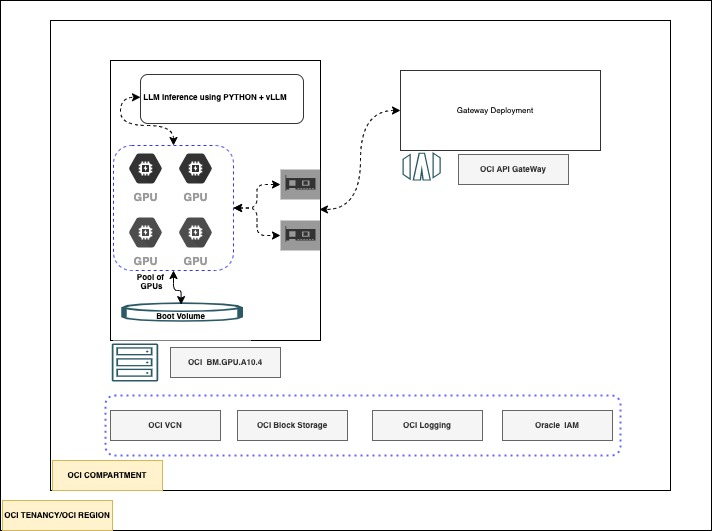

### Terraform stack to host LLMs on OCI GPU based bare metal machines.

An OCI Terraform based approach to host Large Langauage Model for Inference using OCI Bare metal compute machines.



<details>
<summary>Permissions needed to execute</summary>

- The tenancy /region must have necessary limits for GPU machines.Default its uses `BM.GPU.A10.4` ,count 4.
- If the user is not an admin ,the user must have below OCI access.
- Access to manage OCI Resource families such as
```text
logging-family
virtual-network-family
instance-family
volume-family
API-gateway-family
access to retrive ad information
```
- A valid token from Hugging face (READ permission only needed).
- Incase if you are using an access protected repo ,ensure to accept the terms and conditions and get the access in advance,using hugging face portal
</details>

<details>
  <summary>How to use the stack</summary>

### Using OCI terraform provider and Terraform CLI
- create a `terraform.tfvars` file.
```terraform
# Authentication
tenancy_ocid         = "OCID of OCI Tenancy"
user_ocid            = "OCID of OCI User "
fingerprint          = "OCI User fingerprint"
private_key_path     = "OCI User private key path"
# Region
region = "OCI Region"
# Compartment
compartment_ocid = "OCID of OCI Compartment"
#LLM Information
model_path = "PATH of your LLM - example meta-llama/Meta-Llama-3-8B"
huggingface_access_token = "READ access token from Hugging face"
ssh_public_key="SSH Public key to access the BM"

``` 

### Using OCI RMS Stack - Test in progress /Doc to update
</details>
<details>
<summary>Execution flow /Resources covered</summary>

- The Stack creates below OCI resources 
```text
OCI VM based on a GPU Image
OCI API Gateway and Deployment for exposition
```
- The below configurations and startup scripts are executed.
- Startup script can refer [here](scripts/setup.sh)
- The script install all the necessary software libraries and llm.
- It will load and start and provide an inference endpoints
</details>
<details>
<summary>How to use the LLM</summary>

- By default the startup script expose LLM inference with openapi compatible route.
- Some of the possible routes with open-api compatible using vllm are 
```text
/v1/models
/v1/completion
/v1/chat/completion
```
- Refer the execution outcome to fetch the URL and openAPI key 

```terraform
#terraform output LLM_URL
"https://XXXX.<OCIREGION>/path/name"
#terraform output API_KEY
"AlphaNumeric..."
```
- Sample exeuction using curl
```shell
export URL="<LLM_URL value>"
export TOKEN="<API_KEY value>"
curl -k $URL/v1/models  -H "Authorization: Bearer $TOKEN"
```
- Chat completion using python openapi library
```python
#export url = ""
#pip install openai --user
from openai import OpenAI
import os
# Set OpenAI's API key and API base to use vLLM's API server.
openai_api_key = os.environ['TOKEN']
openai_api_base = f"{os.environ['URL']}/v1"
model = "MODEL PATH"

client = OpenAI(
    api_key=openai_api_key,
    base_url=openai_api_base,
)

chat_response = client.chat.completions.create(
    model=model,
    messages=[
        {"role": "system", "content": "size is the length"},
        {"role": "user", "content": "How big was megaladon with length and weight,make short answer"},
    ]
)
print("Chat response:", chat_response)
```
</details>
<details>
<summary>Reference and read more </summary>

- https://docs.oracle.com/en-us/iaas/content-management/doc/service-limits-quotas-policies-and-events.html
- https://docs.vllm.ai/en/latest/getting_started/quickstart.html
</details>

### Contributors

Author : [Rahul M R.](https://github.com/RahulMR42)
Last release : May 2024

This project is open source.  Please submit your contributions by forking this repository and submitting a pull request!  Oracle appreciates any contributions that are made by the open source community.

### License
Copyright (c) 2024 Oracle and/or its affiliates.

Licensed under the Universal Permissive License (UPL), Version 1.0.

See [LICENSE](LICENSE) for more details.

ORACLE AND ITS AFFILIATES DO NOT PROVIDE ANY WARRANTY WHATSOEVER, EXPRESS OR IMPLIED, FOR ANY SOFTWARE, MATERIAL OR CONTENT OF ANY KIND CONTAINED OR PRODUCED WITHIN THIS REPOSITORY, AND IN PARTICULAR SPECIFICALLY DISCLAIM ANY AND ALL IMPLIED WARRANTIES OF TITLE, NON-INFRINGEMENT, MERCHANTABILITY, AND FITNESS FOR A PARTICULAR PURPOSE.  FURTHERMORE, ORACLE AND ITS AFFILIATES DO NOT REPRESENT THAT ANY CUSTOMARY SECURITY REVIEW HAS BEEN PERFORMED WITH RESPECT TO ANY SOFTWARE, MATERIAL OR CONTENT CONTAINED OR PRODUCED WITHIN THIS REPOSITORY. IN ADDITION, AND WITHOUT LIMITING THE FOREGOING, THIRD PARTIES MAY HAVE POSTED SOFTWARE, MATERIAL OR CONTENT TO THIS REPOSITORY WITHOUT ANY REVIEW. USE AT YOUR OWN RISK. 


