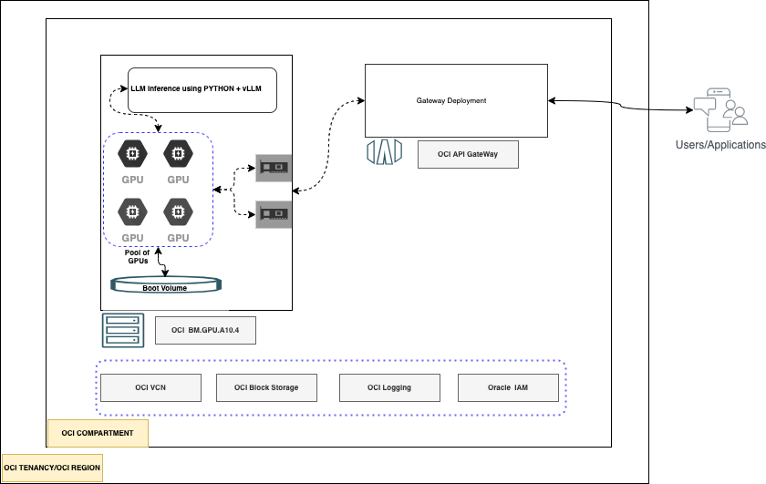
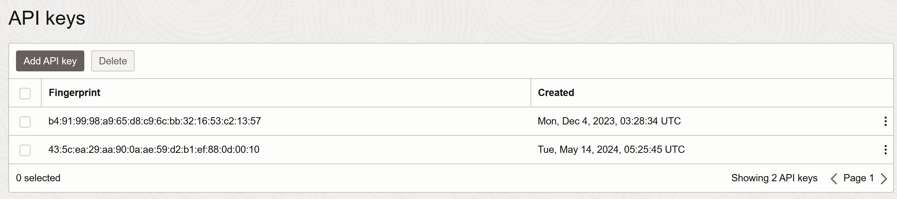

# Terraform stack to host LLMs on OCI GPU-based Bare Metal machines

## Introduction



Have you ever wondered how to deploy a Large Language Model (LLM) on OCI? In this solution, you will learn how to deploy a Large Language Models using NVIDIA OCI Bare Metal Compute Instances (NVIDIA A10 Tensor Core GPUs), with an inference server called `vLLM`.

`vLLM` can be deployed as a server that implements the OpenAI API protocol. This allows vLLM to be used as a drop-in replacement for applications using OpenAI API, meaning that we can choose OpenAI models (like `gpt-3.5` or `gpt4`) to generate text for our request based just in two things:

- The original user's query
- The model name of the LLM you want to run text generation against.

These LLMs can come from any HuggingFace well-formed repository (your choice), so we will need to authenticate to HuggingFace to pull the models (if you haven't built them from source) with an authentication token.

## 0. Prerequisites & Docs

### Prerequisites

In order to run the setup, you will require to have the following requirements:

1. An Oracle Cloud Infrastructure (OCI) Account

2. The user's tenancy and region must have the necessary limits for GPU machines. By default, it uses `BM.GPU.A10.4`, a cluster of 4 tensor cores.

3. If the user is not a tenancy administrator, the user must have OCI access to the following resource groups:

    ```text
    logging-family
    virtual-network-family
    instance-family
    volume-family
    API-gateway-family
    ```

4. A valid API token from HuggingFace (`READ` permission is enough; no need for read + write)
4 In case if you are using an access-protected repository (like LLaMA-2 or LLaMA-3), make sure to accept the terms and conditions and get access to the gated repository in advance, through the HuggingFace portal

### Docs

- [OCI Service Limits and Quotas](https://docs.oracle.com/en-us/iaas/content-management/doc/service-limits-quotas-policies-and-events.html)
- [vLLM Getting Started](https://docs.vllm.ai/en/latest/getting_started/quickstart.html)

## 1. Deploy Infrastructure

We'll use the Terraform stack to deploy the required infrastructure.

### (Recommended) Option 1. Using OCI Terraform provider and Terraform CLI

1. Clone the repository:

    ```bash
    git clone https://github.com/oracle-devrel/oci-terraform-genai-llm-on-gpuvms
    ```

2. Obtain the OCIDs we will need for the next step:

    ```bash
    echo $OCI_TENANCY
    echo $OCI_REGION
    echo $OCI_COMPARTMENT
    ```

3. Create a `terraform.tfvars` file with the following 6 variables (compartment, tenancy, region, user OCIDs, and key location and fingerprint):

    ```bash
    cd oci-terraform-genai-llm-on-gpuvms
    vi terraform.tfvars
    ```

    ```terraform
    # Authentication
    tenancy_ocid         = "OCID of OCI Tenancy"
    user_ocid            = "OCID of OCI User "
    fingerprint          = "OCI User fingerprint"
    private_key_path     = "OCI User private key path"
    # Region
    region = "OCI Region"
    # Compartment
    compartment_ocid = "OCID of OCI Compartment"
    #LLM Information
    model_path = "PATH of your LLM - example meta-llama/Meta-Llama-3-8B"
    huggingface_access_token = "READ access token from Hugging face"
    ssh_public_key="SSH Public key to access the BM"
    ```

    > The private key and fingerprint need to be added to your OCI user within your tenancy, in `Identity >> Domains >> OracleIdentityCloudService >> Users`:

    

    If you don't have one already, you can create a public-private keypair by running the following command in bash:

    ```bash
    ssh-keygen
    ```

4. Execute the Terraform plan & apply:

    ```bash
    terraform init
    terraform plan
    terraform apply
    ```

5. (Optional) After you're done with development and want to delete the stack, run the following command:

    ```bash
    terraform destroy
    ```

    > **Note**: this action is irreversible!

### Option 2. Using OCI RMS Stack - Test in progress /Doc to update

## 3. Execution flow /Resources covered

1. Let's create the required OCI resources with a Terraform stack:

    - OCI VM based on a GPU Image
    - OCI API Gateway and Deployment for exposition

2. Run [this following startup](scripts/setup.sh) script:

    You will need to have an environment variable called:

    ```bash
    export huggingface_access_token = "YOUR_TOKEN"
    ```

    Then, run the setup script:

    ```bash
    cd scripts/ # go to the dir
    chmod a+x setup.sh # allow the script to be executed
    ./setup.sh # run the script
    ```

    With your own HF access token, to be able to pull the Large Language Model.

    This script will install all necessary software libraries, modules, and the LLM.

    It will load and start and provide an inference endpoint, so we can later call the model through an API if we want to.

## 3. How to use the LLM

- By default the startup script expose LLM inference with an OpenAI-compatible route.

- Some of the possible routes with open-api compatible using vLLM are:

    - `/v1/models`
    - `/v1/completion`
    - `/v1/chat/completion`

- After Terraform has completed, refer the execution outcome to fetch the URL and OpenAI key:

    ```terraform
    terraform output LLM_URL
    "https://XXXX.<OCIREGION>/path/name"
    terraform output API_KEY
    "AlphaNumeric..."
    ```

- Sample execution using `curl`:

```bash
export URL="<LLM_URL value>"
export TOKEN="<API_KEY value>"
curl -k $URL/v1/models  -H "Authorization: Bearer $TOKEN"
```

- Chat completion using python OpenAI library

```python
#export url = ""
#pip install openai --user
from openai import OpenAI
import os
# Set OpenAI's API key and API base to use vLLM's API server.
openai_api_key = os.environ['TOKEN']
openai_api_base = f"{os.environ['URL']}/v1"
model = "MODEL PATH"

client = OpenAI(
    api_key=openai_api_key,
    base_url=openai_api_base,
)

chat_response = client.chat.completions.create(
    model=model,
    messages=[
        {"role": "system", "content": "size is the length"},
        {"role": "user", "content": "How big was megaladon with length and weight,make short answer"},
    ]
)
print("Chat response:", chat_response)
```

## Basic Troubleshooting

1. LLM inference is not ready or getting 504 error code when trying the URL:

    - Login to the VM where you've deployed the solution using the SSH private-key you created in chapter 1.
    - Check the startup logs - Default path `/home/opc/llm-init/init.log`.
    - For any failures, refer to [setup.sh](scripts/setup.sh) to know about which exact steps to run manually
    - Check the vLLM service is up and running:

        ```bash
        sudo systemctl status vllm-inference-openai.service
        ```

2. Details about LLM usage or response. We are capturing inference logs under path `/home/opc/vllm-master` with in file `vllm_log_file.log`.
  
### Contributors

Author: [Rahul M R.](https://github.com/RahulMR42)

Editor: [Nacho Martinez](https://github.com/jasperan)

Last release: May 2024

This project is open source. Please submit your contributions by forking this repository and submitting a pull request!  Oracle appreciates any contributions that are made by the open source community.

### License

Copyright (c) 2024 Oracle and/or its affiliates.

Licensed under the Universal Permissive License (UPL), Version 1.0.

See [LICENSE](LICENSE) for more details.

ORACLE AND ITS AFFILIATES DO NOT PROVIDE ANY WARRANTY WHATSOEVER, EXPRESS OR IMPLIED, FOR ANY SOFTWARE, MATERIAL OR CONTENT OF ANY KIND CONTAINED OR PRODUCED WITHIN THIS REPOSITORY, AND IN PARTICULAR SPECIFICALLY DISCLAIM ANY AND ALL IMPLIED WARRANTIES OF TITLE, NON-INFRINGEMENT, MERCHANTABILITY, AND FITNESS FOR A PARTICULAR PURPOSE.  FURTHERMORE, ORACLE AND ITS AFFILIATES DO NOT REPRESENT THAT ANY CUSTOMARY SECURITY REVIEW HAS BEEN PERFORMED WITH RESPECT TO ANY SOFTWARE, MATERIAL OR CONTENT CONTAINED OR PRODUCED WITHIN THIS REPOSITORY. IN ADDITION, AND WITHOUT LIMITING THE FOREGOING, THIRD PARTIES MAY HAVE POSTED SOFTWARE, MATERIAL OR CONTENT TO THIS REPOSITORY WITHOUT ANY REVIEW. USE AT YOUR OWN RISK.
